# Proxmox VE 8 Community Morpheus Cloud Plugin

<u>This is a COMMUNITY maintained plugin WITHOUT official Morpheus support.</u>

The Proxmox Plugin is a Morpheus Cloud Plugin that synchronizes VMs, templates, datastores, networks, resource pools and hypervisor hosts,
then exposes VM Instance provisioning functionality. 

## 📑 Table of Contents

- [Features](#features)
- [Requirements](#requirements)
- [Repository structure](#repository-structure)
- [Building the plugin](#building-the-plugin)
- [License](#license)
- [Installing](#installing)
- [Cloud setup](#cloud-setup)
- [Upload image for provisioning](#upload-image-for-provisioning)
- [Provisioning the image](#provisioning-the-image)


## Features
* Synchronizes Proxmox hosts, VMs, networks, datastores, resource pools and templates
* Provision new virtual machines from Morpheus
* Proxmox templates are represented as virtual images
* Uploading qcow2 images via Morpheus, creates a Proxmox template on the host


## Requirements
* Java 17
* Gradle (the included `gradlew` wrapper should be used for compiling)
* Morpheus appliance version 8.0.0 or later
* Access to a running Proxmox VE environment
* SSH user and password access to each node host, from the Morpheus appliance. (Interim, keys to be added)


## Repository structure
* `src/main/groovy` - Groovy source for the plugin
  * `ProxmoxVePlugin.groovy` - plugin entry point that registers providers
  * `ProxmoxVeCloudProvider.groovy` - defines the cloud integration
  * `ProxmoxVeProvisionProvider.groovy` - handles VM provisioning
  * `sync/` - tasks for syncing hosts, VMs, networks, datastores, resource pools and templates
  * `util/` - helper classes for Proxmox API and SSH operations
* `src/assets` - plugin icons packaged in the jar
* `src/test/groovy` - Spock based unit tests
* `build.gradle` and `gradle.properties` - build configuration


## Building the plugin
Run the following command to compile and package the plugin jar:

```bash
./gradlew clean build
```
The shaded jar will be written to `build/libs/` as `proxmox-ve-<version>-all.jar`. Execute the tests with `./gradlew test`.

## License
This project is licensed under the Apache 2.0 License. See the [LICENSE](LICENSE) file for details.

## Installing
Upload the compiled `Proxmox8-x.x.x-all.jar` from the `build/libs/` directory under `Administration > Integrations > Plugins` UI location.

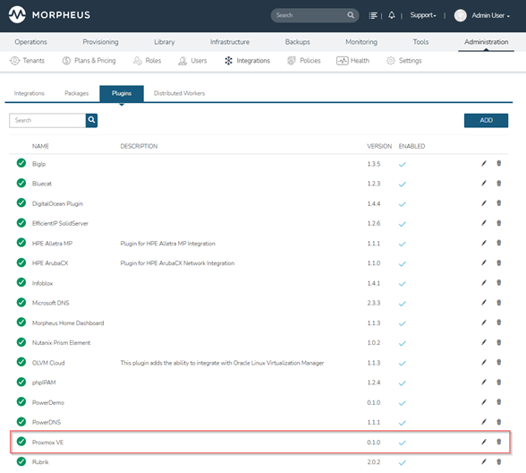

## Cloud setup

For the examples in this document, we will connect to a typical 3 node Proxmox cluster:

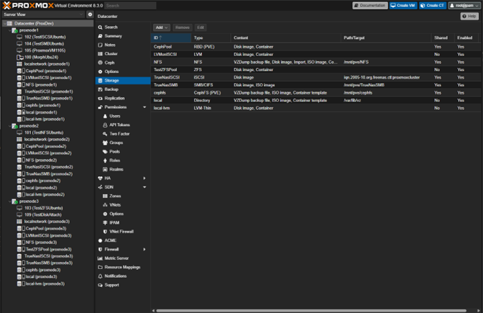

Add the cloud to Morpheus under `Infrastructure > Clouds > Add`:

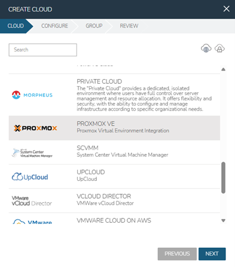

Some operations require SSH access to the proxmox cluster host. The plugin assumes the same ssh user and password credentials on all nodes. SSH Keys planned for future versions.
The plugin uses SSH commands for the upload of qcow disk images to create Proxmox Templates and creating cloud init disks from yaml content.

**"Initial Host Username"** and **"Initial Host Password"** are used to establish SSH connections.

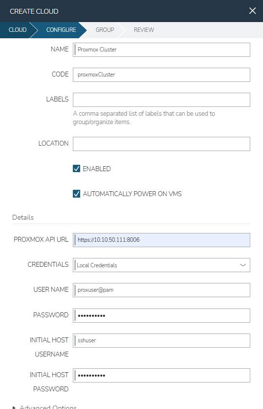

Once the cloud connects successfully, various artifacts are synchronized under `Infrastructure > Clouds > Proxmox Cluster`:

### Proxmox Hypervisor hosts:

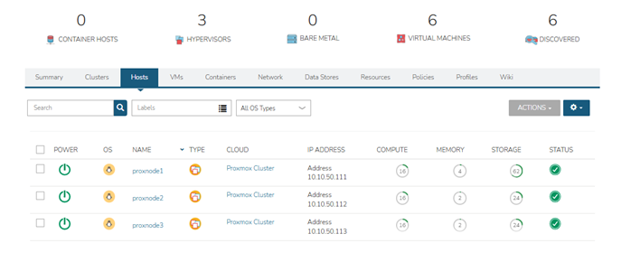

### Proxmox VMs:

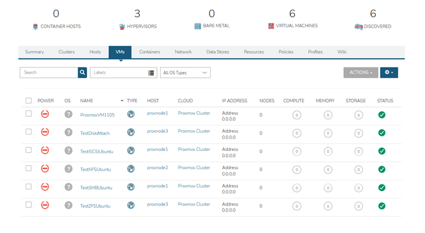

### Datastores:

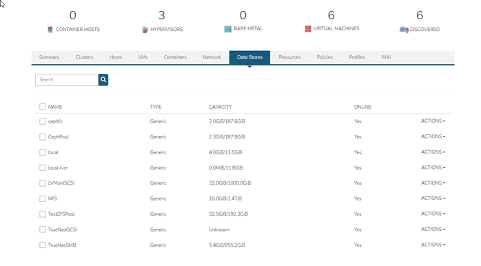

### Networks:


### Resource pools:

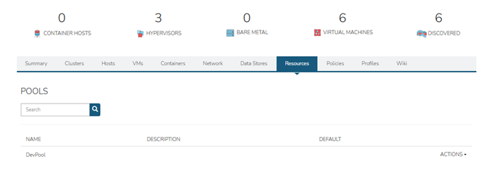

### Templates (Virtual images - `Library > Virtual Images > Synced`):

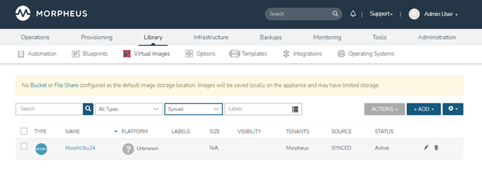

## Upload image for provisioning

When uploading an image, Morpheus requires the image to be setup for cloud init and Morpheus.
Follow the documentation guide here: https://docs.morpheusdata.com/en/latest/integration_guides/Clouds/vmware/vmware_templates.html?highlight=virtual%20image

Upload the image under `Library > Virtual Images > Add > QCOW2`

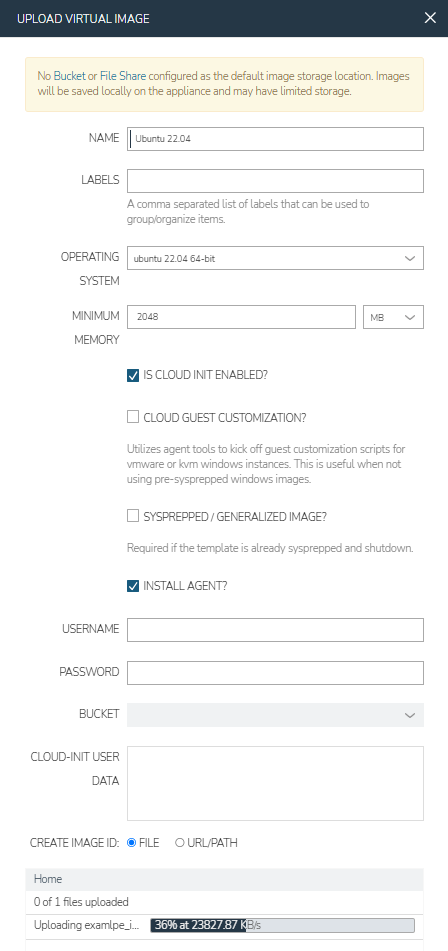

Uncheck **"VM Tools Installed"** and **"VirtIO Drivers Loaded"**:

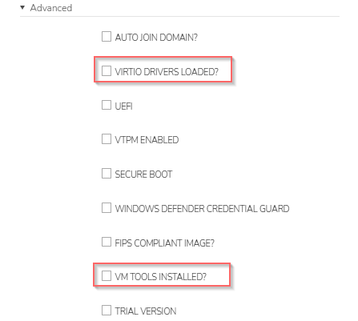

Change the filter to **"User"** to view your upload:

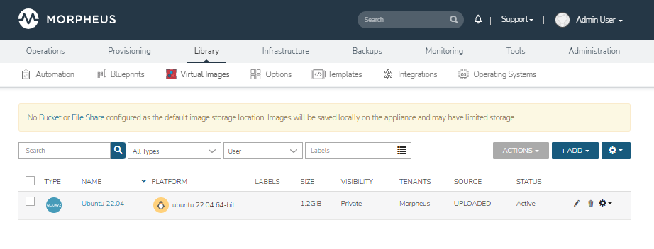

## Provisioning the image

The below provisioning assumes that your datastores and networks have been configured appropriately e.g., DHCP and gateway.

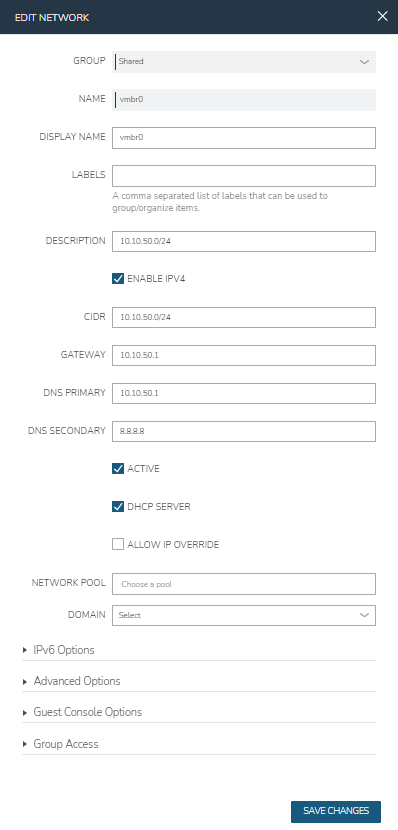

Navigate to `Provisioning > Instances > Add` and choose `Proxmox` in the **"Create Instance"** dialog:

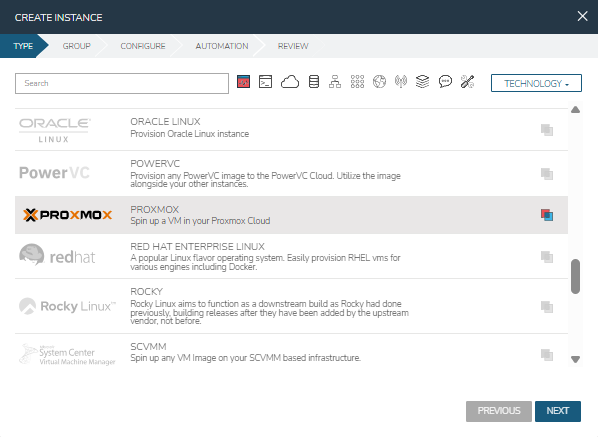

Configure the instance with the target Proxmox node and the virtual image. Notice that the image needs to be uploaded to Proxmox,
even though it is already present in Morpheus. 


Complete the provisioning. The first time a qcow2 virtual image is used, it will be uploaded to Proxmox, and a Template will be created from it, 
for future provisioning. 

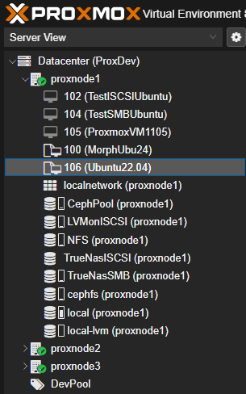


